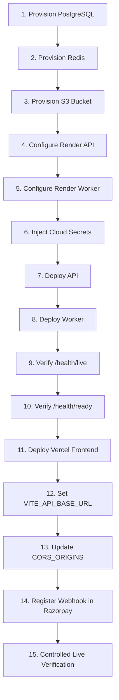

# RecoverX Production Operations & Infrastructure Runbook

**Product Identity**: RecoverX is an AI-assisted Revenue Exception Recovery Agent.
**Document Status**: `PRODUCTION INFRASTRUCTURE SPECIFICATION`

---

## 1. System Architecture

```
                 Internet
                    │
                    ▼
                 Vercel (React Frontend)
                    │
                  HTTPS
                    │
                    ▼
             RecoverX API (FastAPI)
                    │
        ┌───────────┼────────────┐
        │           │            │
        ▼           ▼            ▼
   PostgreSQL     Redis      Object Storage
  Managed DB     Rate Limit    AWS S3 / MinIO
        │
        ▼
   Durable Queue
        │
        ▼
 Independent Worker Daemon
        │
        ▼
 Razorpay API (Test / Live)
```

---

## 2. Required Environment Variables

| Variable | Environment | Status | Description |
| :--- | :---: | :---: | :--- |
| `ENVIRONMENT` | Production | `CONFIGURED IN CODE` | Set to `production` (enforces strict security, disables debug & Swagger) |
| `DATABASE_URL` | Production | `CONFIGURED IN CODE` | Managed PostgreSQL connection string with `sslmode=require` |
| `DB_POOL_SIZE` | Production | `CONFIGURED IN CODE` | PostgreSQL SQLAlchemy connection pool size (Default: `20`) |
| `DB_MAX_OVERFLOW` | Production | `CONFIGURED IN CODE` | Maximum connection burst overflow (Default: `30`) |
| `DB_POOL_TIMEOUT` | Production | `CONFIGURED IN CODE` | Timeout for connection acquisition in seconds (Default: `30.0`) |
| `DB_POOL_RECYCLE` | Production | `CONFIGURED IN CODE` | Connection recycle lifetime in seconds (Default: `1800`) |
| `JWT_SECRET` | Production | `CONFIGURED IN CODE` | Cryptographically secure 256-bit secret string |
| `RAZORPAY_KEY_ID` | Production | `CONFIGURED IN CODE` | Razorpay Merchant Key ID (`rzp_test_...` or live key upon cutover) |
| `RAZORPAY_KEY_SECRET` | Production | `CONFIGURED IN CODE` | Razorpay Merchant Secret Key |
| `RAZORPAY_WEBHOOK_SECRET` | Production | `CONFIGURED IN CODE` | Webhook HMAC verification secret |
| `CORS_ORIGINS` | Production | `CONFIGURED IN CODE` | Comma-separated list of explicit frontend domains (e.g. `https://recoverx.vercel.app`) |
| `OBJECT_STORAGE_PROVIDER` | Production | `CONFIGURED IN CODE` | Set to `s3` (local filesystem allowed only in development) |
| `S3_BUCKET` | Production | `REQUIRES CLOUD PROVIDER CONFIGURATION` | S3 / R2 / GCS Bucket name |
| `S3_REGION` | Production | `REQUIRES CLOUD PROVIDER CONFIGURATION` | S3 Region (e.g. `us-east-1`, `ap-south-1`) |
| `S3_ENDPOINT_URL` | Production | `REQUIRES CLOUD PROVIDER CONFIGURATION` | Custom endpoint for MinIO / Cloudflare R2 / Wasabi (optional for AWS) |
| `S3_ACCESS_KEY_ID` | Production | `REQUIRES CLOUD PROVIDER CONFIGURATION` | Cloud storage IAM Access Key |
| `S3_SECRET_ACCESS_KEY` | Production | `REQUIRES CLOUD PROVIDER CONFIGURATION` | Cloud storage IAM Secret Key |
| `RATE_LIMIT_BACKEND` | Production | `CONFIGURED IN CODE` | Set to `redis` in production for multi-replica scaling |
| `REDIS_URL` | Production | `REQUIRES CLOUD PROVIDER CONFIGURATION` | Managed Redis connection string (`redis://...`) |

---

## 3. Secret Management Policy

- **Zero Git Secrets**: Secrets are NEVER hardcoded or committed to version control.
- **Provider Injection**: All credentials must be injected dynamically via hosting provider secrets (Render Environment, AWS Secrets Manager, Doppler, Vault).
- **Log Sanitization**: Application exception handlers and log filters automatically mask authorization tokens, card data, and API secrets.

---

## 4. Production Cloud Deployment Sequence



Follow this step-by-step procedure strictly during cloud rollout:

- **STEP 1 — Provision PostgreSQL Database**:
  - Provision Managed PostgreSQL (v15+) cluster on Render or AWS RDS (`sslmode=require`).
  - Record the internal connection string: `DATABASE_URL`.
- **STEP 2 — Provision Managed Redis**:
  - Provision Managed Redis (v7+) cluster on Render or Upstash/Redis Cloud.
  - Record the secure connection string: `REDIS_URL`.
- **STEP 3 — Provision Private S3-Compatible Bucket**:
  - Create a private cloud bucket (AWS S3, Cloudflare R2, MinIO) with default encryption (`SSE-S3`) and public access blocked.
  - Record `S3_BUCKET`, `S3_REGION`, `S3_ACCESS_KEY_ID`, `S3_SECRET_ACCESS_KEY`.
- **STEP 4 — Configure Render API Service**:
  - Create Web Service `recoverx-api` linked to GitHub repository.
  - Set build command: `pip install -r requirements.txt`.
  - Set start command: `uvicorn app.main:app --host 0.0.0.0 --port $PORT`.
  - Set health check path: `/health/live`.
- **STEP 5 — Configure Render Worker Daemon**:
  - Create Background Worker `recoverx-worker` linked to same GitHub repository.
  - Set build command: `pip install -r requirements.txt`.
  - Set start command: `python -m app.workers.worker`.
- **STEP 6 — Inject Production Secrets in Cloud Dashboard**:
  - Inject `DATABASE_URL`, `REDIS_URL`, `JWT_SECRET`, `RAZORPAY_KEY_ID`, `RAZORPAY_KEY_SECRET`, `RAZORPAY_WEBHOOK_SECRET`, `S3_*` variables.
- **STEP 7 — Deploy API Service**:
  - Trigger initial build and deployment of `recoverx-api`.
- **STEP 8 — Deploy Background Worker**:
  - Trigger initial deployment of `recoverx-worker`.
- **STEP 9 — Verify Process Liveness**:
  - `curl -f https://<production-api-domain>/health/live` $\rightarrow$ must return `{"status": "ok"}` (HTTP 200).
- **STEP 10 — Verify Dependency Readiness**:
  - `curl -f https://<production-api-domain>/health/ready` $\rightarrow$ must return `{"status": "ready", "database": "connected", "durable_queue": "active", ...}` (HTTP 200).
- **STEP 11 — Deploy React Frontend to Vercel**:
  - Link `frontend/` directory to Vercel project.
  - Set Framework Preset to `Vite`.
- **STEP 12 — Configure Frontend API Endpoint**:
  - Set `VITE_API_BASE_URL=https://<production-api-domain>` in Vercel environment settings and deploy.
- **STEP 13 — Update Backend CORS Origins**:
  - Set `CORS_ORIGINS=https://<production-frontend-domain>` in Render dashboard for `recoverx-api`.
- **STEP 14 — Register Production Razorpay Webhook**:
  - In Razorpay Merchant Dashboard $\rightarrow$ Webhooks $\rightarrow$ Add New Webhook:
  - URL: `https://<production-api-domain>/api/webhooks/razorpay`
  - Secret: Same secret value entered in `RAZORPAY_WEBHOOK_SECRET`.
  - Events: `payment.captured`, `payment.failed`, `payment.authorized`, `payment.dispute.*`, `settlement.processed`.
- **STEP 15 — Controlled Live End-to-End Verification**:
  - Execute a nominal ₹1.00 live transaction and verify dispute/settlement sync.

---

## 5. Database Backup & Point-in-Time Recovery (PITR)

- **Backup Policy**:
  - Daily full automated snapshot (retention: 30 days minimum).
  - Continuous WAL archiving for 7-day Point-in-Time Recovery (PITR) where supported by provider.
- **Status**: `REQUIRES CLOUD PROVIDER CONFIGURATION` (Provider-level managed database backup).
- **Restore Testing**: Bi-annual verification of snapshot restore to a staging cluster.

---

## 6. Database Restore Procedure

1. Identify the target restore point timestamp (UTC).
2. Provision a restored database instance from the provider PITR snapshot.
3. Verify table counts (`merchants`, `transactions`, `recovery_cases`, `disputes`, `settlements`).
4. Update `DATABASE_URL` secret on the API and worker services.
5. Trigger zero-downtime rolling deployment of the API and worker.

---

## 7. Worker Crash & Restart Procedure

- **Decoupled Queue Resilience**: The durable queue persists in the PostgreSQL database.
- **Automatic Recovery**:
  - When the worker daemon restarts, `poll_and_process_pending_events()` automatically queries and resumes unacknowledged jobs (`status = "received"` or `"processing_retry"`).
  - Unrecoverable events transition to Dead-Letter Queue (`status = "dead_letter"`) with an immutable audit trail.
- **Manual Restart Command**:
  ```bash
  # In hosting dashboard (Render / Kubernetes):
  render services restart recoverx-worker
  # or
  kubectl rollout restart deployment/recoverx-worker
  ```

---

## 8. Redis Failure & Rate Limiter Fallback

- **Circuit Resilience**:
  - If Redis becomes unreachable, `RedisRateLimiter` logs a warning and automatically falls back to the in-memory rate limiter without crashing API traffic.
  - Health check (`GET /health/ready`) reports HTTP 503 until Redis is restored, signalling load balancers while serving in-flight traffic safely.

---

## 9. Object Storage Failure Behavior

- **Document Safety**:
  - If S3 upload fails during customer evidence upload, the transaction rolls back cleanly, returning `HTTP 502 Bad Gateway`.
  - Download operations utilize pre-signed URLs directly from the cloud provider, relieving API servers of heavy file proxying.

---

## 10. Rollback Procedure

1. **Code Rollback**:
   - Trigger previous deployment build on Render / Vercel.
2. **Schema Compatibility**:
   - All migrations maintain backward-compatible non-destructive schema additions.

---

## 11. Health & Readiness Monitoring

- **`GET /health/live`**: Checks process liveness only. Returns `HTTP 200` without dependencies.
- **`GET /health/ready`**: Deep readiness probe verifying:
  - PostgreSQL connectivity (`SELECT 1`)
  - Durable queue daemon state
  - Redis connection (when `RATE_LIMIT_BACKEND=redis`)
  - Object storage bucket accessibility (when `OBJECT_STORAGE_PROVIDER=s3`)
  - Returns `HTTP 503 Service Unavailable` if any required dependency fails.

---

## 12. Observability & Telemetry

- **Structured Correlation**: Every request generates and passes `X-Request-ID`.
- **Operational Metrics**:
  - Ingestion throughput (req/s)
  - Webhook ACK latency p50 / p95 / p99
  - Worker processing duration
  - Queue depth and DLQ count
  - Error rate by HTTP status code

---

## 13. Alerting Definitions

| Severity | Alert Condition | Trigger Threshold | Recommended Action |
| :---: | :--- | :--- | :--- |
| **CRITICAL** | API Service Unavailable | `/health/live` != 200 for > 1 min | Inspect container crash logs / OOM |
| **CRITICAL** | Database Disconnected | `/health/ready` returns 503 | Check PostgreSQL cluster health / connections |
| **CRITICAL** | DLQ Spike | > 5 dead-lettered events in 10 min | Inspect webhook parser & provider payload schema |
| **HIGH** | Razorpay API Errors | > 5% 5xx errors from Razorpay | Verify Razorpay API status page & credentials |
| **HIGH** | Rate Limiter Disruption | Redis ping failure in health check | Inspect Redis memory & connection limits |
| **MEDIUM** | Approaching Dispute Deadlines | Dispute respond_by < 24h | Notify merchant via notification service |
| **MEDIUM** | High Reconciliation Variance | Discrepancy > ₹1,000.00 | Queue for merchant finance review |

---

## 14. Incident Response Protocol

1. **Triage**: Check Datadog / Cloud logs using `X-Request-ID`.
2. **Containment**: If a webhook event type is causing parse errors, pause worker consumer while API continues durable ACK ingestion.
3. **Remediation**: Deploy hotfix or trigger payment resynchronization via `/api/webhooks/recovery/{id}/sync`.
4. **Post-Mortem**: Document root cause, financial impact, and preventative controls.

---

## 15. Razorpay Webhook Configuration

- **URL**: `https://<api-domain>/api/webhooks/razorpay`
- **Secret**: Stored in `RAZORPAY_WEBHOOK_SECRET`
- **Subscribed Events**:
  - `payment.captured`, `payment.failed`, `payment.authorized`
  - `payment.dispute.created`, `payment.dispute.action_required`, `payment.dispute.under_review`, `payment.dispute.won`, `payment.dispute.lost`, `payment.dispute.closed`
  - `settlement.processed`

---

## 16. Razorpay LIVE-Mode Migration Checklist

- [ ] Complete business KYC verification on Razorpay Dashboard.
- [ ] Generate Razorpay LIVE API Key ID & Secret.
- [ ] Configure LIVE Webhook URL and Webhook Secret on Razorpay Dashboard.
- [ ] Update `RAZORPAY_KEY_ID`, `RAZORPAY_KEY_SECRET`, `RAZORPAY_WEBHOOK_SECRET` in cloud provider secrets.
- [ ] Execute single nominal ₹1.00 live transaction test to verify end-to-end settlement and webhook pipeline.

---

## 17. Disaster Recovery Checklist

- [ ] Multi-region S3 bucket replication configured.
- [ ] Automated database snapshots verified on staging cluster.
- [ ] Secondary failover database connection string documented.
- [ ] Key rotation runbook tested for JWT and API keys.

---

## 18. Pre-Launch Verification Matrix

| Component | Status | Verification Notes |
| :--- | :---: | :--- |
| **FastAPI Core & API Routes** | `VERIFIED` | 146+ unit tests passing |
| **PostgreSQL 18.4 Engine** | `VERIFIED` | Staging concurrency & load verified |
| **Durable Webhook Queue** | `VERIFIED` | Async retry and DLQ verified |
| **Independent Worker** | `VERIFIED` | Separate daemon process operational |
| **Payment Recovery Service** | `VERIFIED` | 10/10 targeted tests passing |
| **S3 Object Storage Code** | `CONFIGURED IN CODE` | Abstraction verified with pre-signed URLs |
| **Redis Rate Limiter Code** | `CONFIGURED IN CODE` | Atomic sliding-window & fallback verified |
| **Managed S3 Bucket** | `REQUIRES CLOUD PROVIDER CONFIGURATION` | To be created in AWS / Cloudflare account |
| **Managed Redis Instance** | `REQUIRES CLOUD PROVIDER CONFIGURATION` | To be provisioned in cloud hosting provider |
| **Production Domain & SSL** | `REQUIRES CLOUD PROVIDER CONFIGURATION` | Cloud DNS & TLS certificate binding |
| **Razorpay LIVE Credentials** | `NOT YET VERIFIED` | Awaiting final business production cutover |

